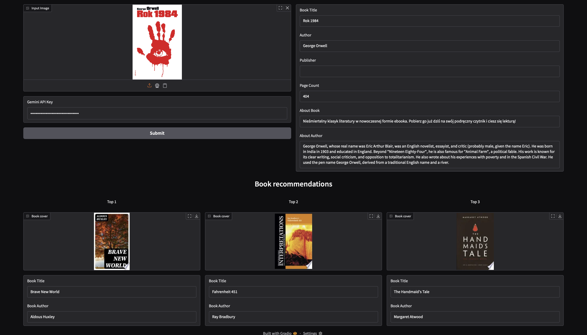

<div align="center">
<h1> ScanReads </h1>
<h3> Automatic book cover recognition </h3>
Kornel Howil*, Dominik Matuszek*

(* denotes equal contribution)

 [](https://github.com/kornelhowil/ScanReads)
</div>

### What is this project about?
The main goal of this project is to build an app that takes an image of a book cover and:
1. Automatically reads the title, author, and publisher  
2. Recommends similar books

<div align="center">

</div>


### Quick Start
1. Clone this repository (you know how to do this)
2. Install the required packages
```bash
pip install -r requirements.txt
```
3. Generate [Gemini API key](https://aistudio.google.com/apikey)
4. You're good to go!
```bash
python app.py
```

### Content of this repository
- <span>app.py<span> - Gradio app
- example/1984.jpg - A sample book cover
- requirements.txt - Python dependencies
- scanreads - Backend of the application


